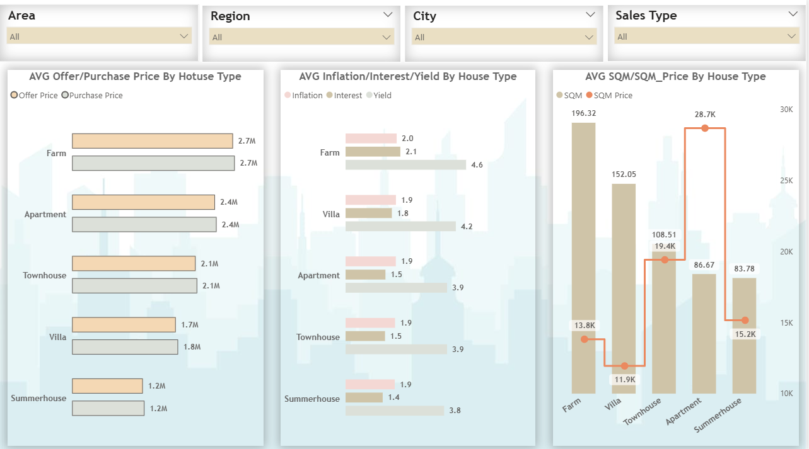
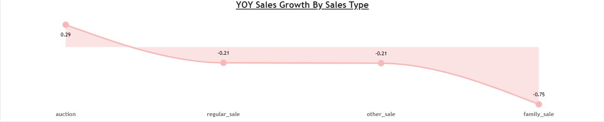
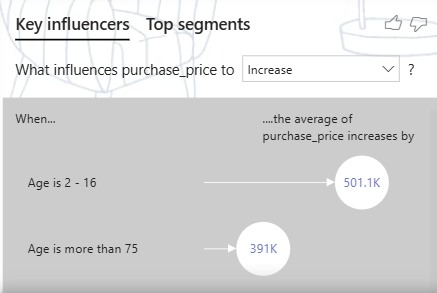
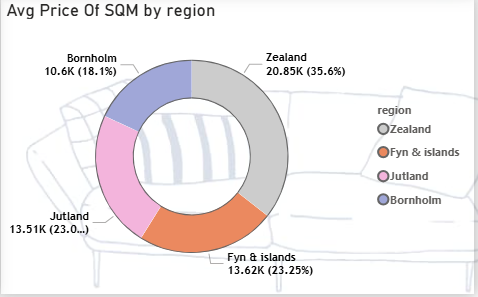

# 🏡 Housing Project | SQL Server + Google BigQuery + Power BI  

🚀 Exciting Update! 🚀  
I’m thrilled to announce the completion of my **end-to-end Housing Data Analysis project** — a journey that combined **data engineering, advanced analytics, and interactive visualization** into a single solution. 🌟  

---

## 🔎 Project Overview  
The goal of this project was to **analyze housing data at scale**, uncover **market trends**, and provide actionable insights for stakeholders.  

Key steps in the workflow:  
- 📥 **Microsoft SQL Server** → Initial data ingestion, cleaning, and relational structuring  
- ☁️ **Google BigQuery** → Cloud-scale querying and data transformation using SQL  
- 🛠 **Power Query Editor** → Refinement, shaping, and data consistency checks  
- 📊 **Power BI Desktop** → Interactive reports & dashboards with real-time metrics  

---

## 🛠 Tools & Technologies  
- **SQL Server** – For staging, cleaning, and preparing raw datasets  
- **Google BigQuery** – For fast, scalable data warehousing and querying  
- **Power Query Editor** – ETL, cleaning, and schema adjustments  
- **DAX (Data Analysis Expressions)** – Custom measures for KPIs  
- **Power BI Desktop & Service** – Dashboard design, publishing, and automation  

---

## 📊 Visualizations Included  
The report spans **3 interactive pages**, showcasing:  
- 🔹 **Scatter Plots** – Housing demand vs. pricing trends  
- 🔹 **Clustered & Stacked Bar Charts** – Regional comparisons and category performance  
- 🔹 **Column Charts** – Time-based price shifts & growth metrics  
- 🔹 **Donut Charts** – Property type distribution and sales share  
- 🔹 **Card Visuals** – Quick KPIs like *Average Price, Total Properties, Median Value*  
- 🔹 **Tables** – Detailed drill-down by region, builder, and property type  
- 🔹 **Key Influencer Visual** – Identify main drivers impacting housing prices  

---

## 🧮 DAX Functions Used  
- **CALCULATE** → Context-based KPI calculations  
- **YEAR** → Time intelligence for trends  
- **MAX / IF / BLANK** → Conditional KPIs & null handling  
- **MEDIANX** → Distribution analysis  
- **ALLEXCEPT** → Custom filtering for segmentation  

---

## ✨ Dashboard Highlights  
- 🌍 **Regional Insights** – Map visuals to analyze housing trends by geography  
- 📈 **Trend Analysis** – Demand, pricing, and growth patterns across years  
- 🏘 **Category Focus** – Breakdown by property type & segment  
- 📊 **Dynamic Filtering** – Interactive slicers for location, year, and category  
- ⚡ **Performance Optimized** – Star schema design with efficient refresh schedules  

---

## 📌 Preview  

### 1️⃣ Housing Market Overview  
  

### 2️⃣ Trends Analysis  
  
  

### 3️⃣ Key Influencer Visual  
  

### 4️⃣ Donut Chart (Property Distribution)  
  

---

## 📈 Key Outcomes  
1. Delivered **scalable housing market analytics** using hybrid cloud & on-premise data sources  
2. Enabled **precise KPI tracking** with advanced DAX measures  
3. Designed an **intuitive, multi-page Power BI dashboard** for decision-makers  
4. Enhanced **data transparency** for pricing, demand, and regional segmentation  

---

## 🚀 Future Enhancements  
- 🔹 Integrate predictive models for **housing price forecasting**  
- 🔹 Automate data refresh pipelines from SQL → BigQuery → Power BI  
- 🔹 Expand dashboard to include **mortgage & loan-related insights**  

---

## 📬 Contact  
👤 **gmule014-dotcom**  
📧 gmule014@gmail.com  
🔗 [GitHub Repository](https://github.com/gmule014-dotcom/Housing-Project-Google-Cloud-and-Power-BI)  

---

## 🙌 Acknowledgments  
- Microsoft SQL Server  
- Google BigQuery  
- Power BI Community  
